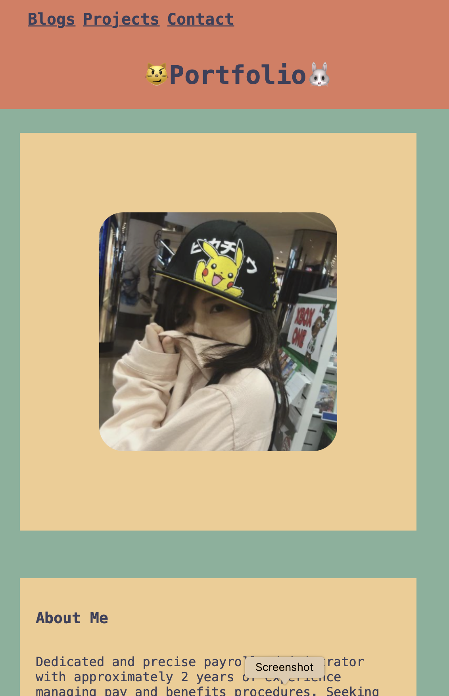
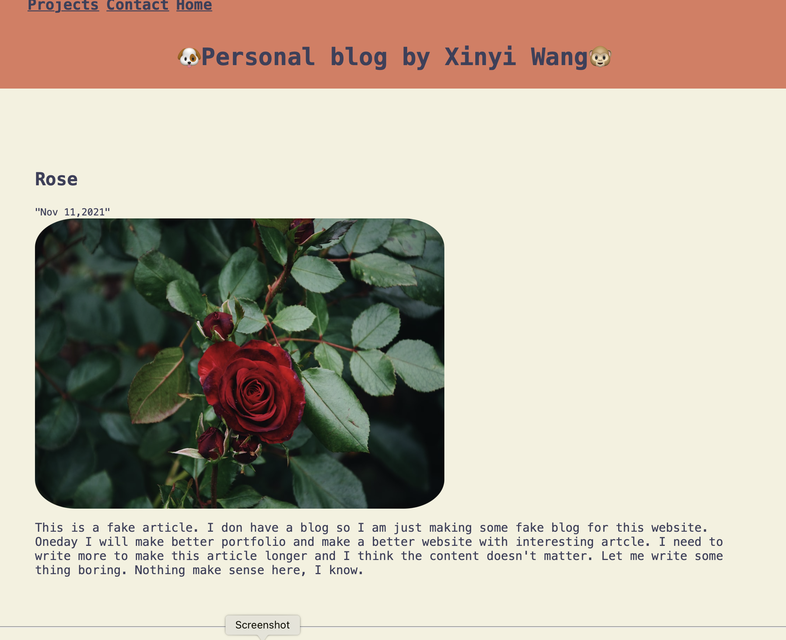

# T1A2 Portfolio

- [Link to website] 

- [Link to Repo](https://github.com/xinyirachel/Portfolio)

### Purpose

Building a friendly and stylish personal website to demonstrate HTML and CSS skills. This personal website is a platform to used for personal career marketing by containing my resume and projects I participated.

### Functionality / Features

This website is designed to looks good on computer, ipad and iphone by using flexbox and media breakpoint. The pictures on all pages will getting smaller if the max-width of the screen is less than 375px. When the window getting narrower, the content on home page and project page will wrap vertically to fit a screen with ipad size. Buttons for downloading resume and linking to my Github and LinkedIn account can be found on home page. Visitor can send messgae to my email by typing information and clicking send button on contact page. Links buttons color will changed on hover.

### Sitemap

There are 4 pages: home (index), blog, projects and contact.

### Screenshots

### Target Audience

- Future employers. 
- Mentors.

### Tech stack

- HTML & CSS & markdown
- Code saved on GitHub
- Building wireframs using Balsamiq
- Building wireframs using diagrams.net
- Choosing palettes on Coolers
- Deployed on Netlify
- Formspree
